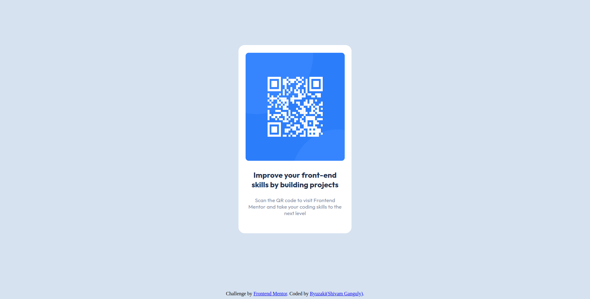

# Frontend Mentor - QR code component solution

This is a solution to the [QR code component challenge on Frontend Mentor](https://www.frontendmentor.io/challenges/qr-code-component-iux_sIO_H). Frontend Mentor challenges help you improve your coding skills by building realistic projects.

## Table of contents

- [Overview](#overview)
  - [Screenshot](#screenshot)
  - [Links](#links)
- [My process](#my-process)
  - [Built with](#built-with)
  - [What I learned](#what-i-learned)
  - [Continued development](#continued-development)
- [Author](#author)
- [Acknowledgments](#acknowledgments)

## Overview

### Screenshot



### Links

- Solution URL: [GitHub Repo](https://github.com/MonarchRyuzaki/QR-Code-Component)
- Live Site URL: [GitHub Pages](https://monarchryuzaki.github.io/QR-Code-Component/)

## My process

### Built with

- Semantic HTML5 markup
- CSS custom properties
- Flexbox

### What I learned

This challenges was a nice way to brush up my basics of HTML and CSS, especially Flexbox.

```css
Centers the panel
.cont{
    display: flex;
    justify-content: center;
    align-items: center;
    min-height: 100vh;
}

```

```css
Centers the item within the panel
.card{
    background-color: white;
    width: 100%;
    max-width: 365px;
    display: flex;
    flex-direction: column;
    justify-content: center;
    align-items: center;
    border-radius: 20px;
}
```

### Continued development

I would like to outline areas such as layouts and Flexbox for future projects. Hopefully I dont spent too much time on it and gradually refine it.

## Author

- LinkedIn - [Shivam Ganguly](https://www.linkedin.com/in/shivam-ganguly-357b90255/)
- Frontend Mentor - [@MonarchRyuzaki](https://www.frontendmentor.io/profile/MonarchRyuzaki)

## Acknowledgments

Special Thanks to [Colt Steele](https://www.udemy.com/user/coltsteele/) for his [Web Development Bootcamp](https://www.udemy.com/course/the-web-developer-bootcamp/).
